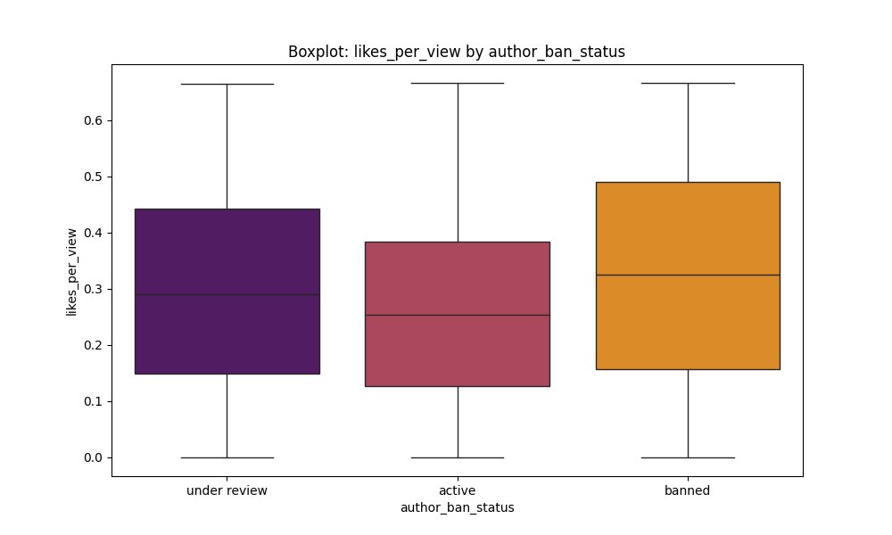
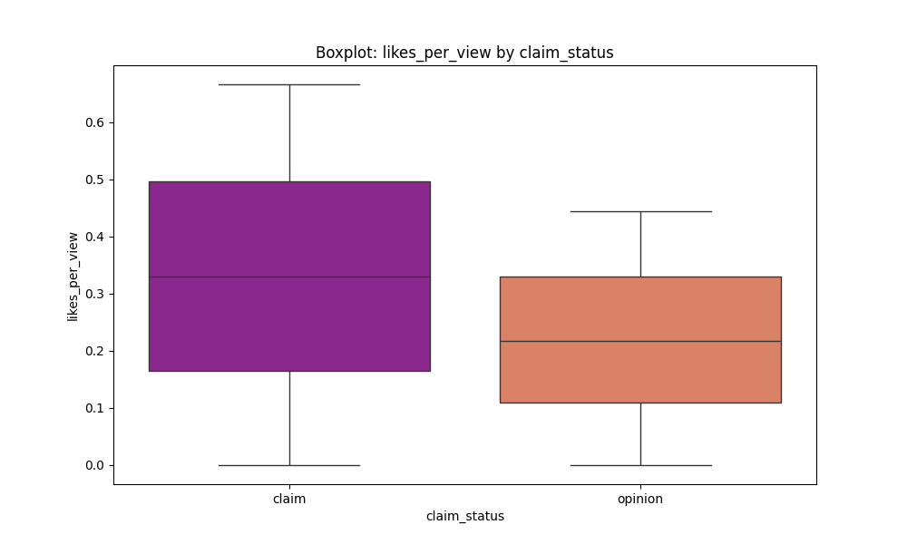
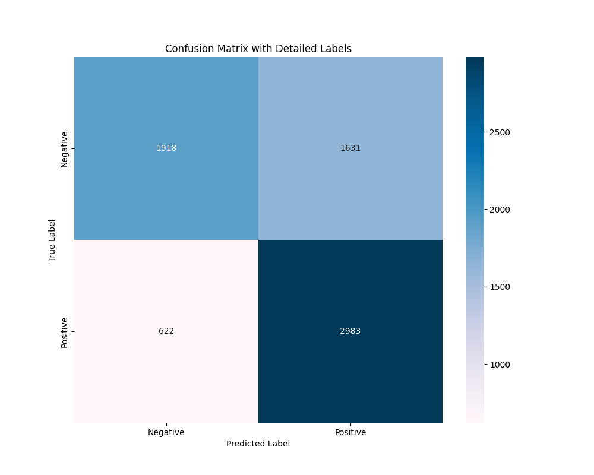
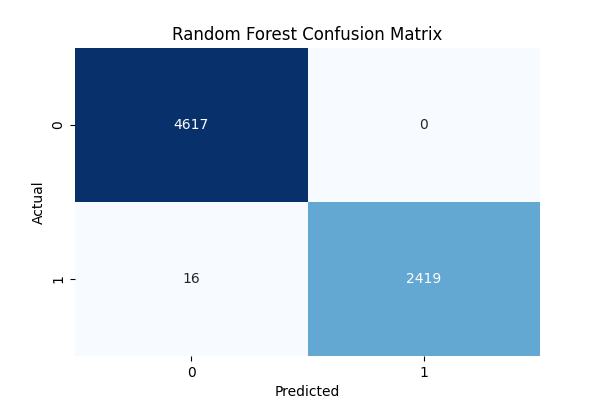
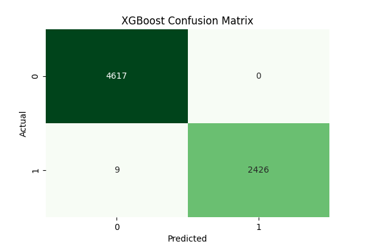

---
TikTok Video Claim Classification Project
---
----

Project Overview
----

This project aims to classify TikTok videos into Claim or Opinion categories based on video metadata, author info, and video transcription text. The goal is to develop and compare multiple machine learning models to accurately predict the claim status of TikTok videos.

Dataset Summary
----
Total records: 19,382 videos initially.

Key features:

video_duration_sec, video_view_count, video_like_count, video_share_count, video_comment_count, video_download_count

Author attributes: author_ban_status, verified_status

Textual data: video_transcription_text

Target: claim_status (Claim vs Opinion)

Data Cleaning and Preprocessing
----
Removed rows with missing critical data (reducing dataset to ~19,000 rows).

Handled outliers in numerical columns using the IQR method (e.g., text_length).

Encoded target variable claim_status as binary: claim = 1, opinion = 0.

One-hot encoded categorical variables (author_ban_status, verified_status).

Created normalized engagement metrics:

likes_per_view

shares_per_view

comments_per_view

Processed video transcription text using TF-IDF vectorization followed by Truncated SVD for dimensionality reduction.

Exploratory Data Analysis (EDA)
----
Significant statistical difference found in text_length between claim and opinion videos (p-value << 0.05).

Engagement metrics (likes_per_view, shares_per_view, comments_per_view) were analyzed across claim/opinion and user ban status.

Visualizations (boxplots, countplots) provided insight into feature distributions and class balances.

[Insert EDA Visualizations Here]

Modeling Approaches
----
In this project, three different classification models were used to predict verified status on TikTok based on several user characteristics. The three models are:

Logistic Regression:
This model was used because it is the simplest and most interpretable model. The primary goal was to serve as a baseline for evaluating the performance of more complex models. The model relies on a linear relationship between variables and the verification result, and is suitable as a starting point for understanding whether the data contains clear signals that characterize verified accounts.

Random Forest Classifier:
This model was used because of its high ability to handle nonlinear relationships and multidimensional data. It also reduces the possibility of overfitting by combining multiple decision trees. Using it helped improve classification accuracy and compare its performance with the logistic model.

XGBoost (Extreme Gradient Boosting):

This is one of the most powerful reinforcement learning models and was used as an advanced stage after the previous two models to extract the best possible performance. XGBoost is characterized by its ability to handle overlap between variables, efficiently handle imbalanced data, and improve performance by reinforcing learning from past errors. This model demonstrated the best performance in terms of precision, recall, and F1-score metrics.

Results Summary
----
| النموذج              | الدقة (Accuracy) | الاستدعاء (Recall) | F1-Score |
|----------------------|------------------|---------------------|----------|
| Logistic Regression  | 0.9793           | 0.9518              | 0.9754   |
| Random Forest        | 0.9977           | 0.9938              | 0.9969   |
| XGBoost              | 0.9987           | 0.9963              | 0.9981   |

XGBoost outperformed both Logistic Regression and Random Forest across all key metrics.

The model shows excellent precision and recall, indicating balanced performance for both classes.

Confusion Matrices

Random Forest confusion matrix shows very high true positive and true negative rates.

XGBoost confusion matrix further improves recall on the positive class (claim).

Feature Importance and Interpretation
----
Key features impacting classification include:

Text length

Engagement ratios (likes, shares, comments per view)

Author verification and ban status

TF-IDF components from video transcription text also contributed meaningfully to model performance.

[Insert Feature Importance Plot Here]

Conclusion
----
The classification models demonstrate strong ability to distinguish between claim and opinion TikTok videos.

XGBoost proved to be the most effective model with the highest accuracy and balanced precision/recall.

Integrating textual features with metadata and author attributes significantly improves classification.

The methodology can be extended to other social media platforms and content moderation tasks.

