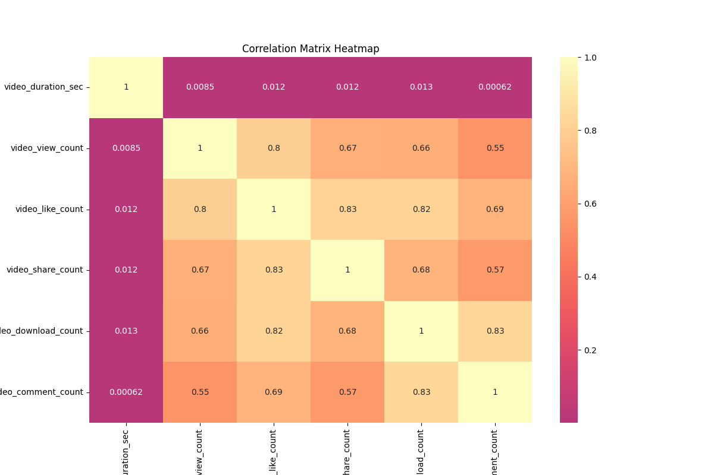

---
Predicting TikTok Verified Accounts Using Logistic Regression
---

**Overview**
----

This project explores TikTok video data to predict whether a video was posted by a verified user.  
Using Python, I applied the full data science workflow including:

- Exploratory Data Analysis (EDA)
- Outlier treatment and feature engineering
- Class imbalance handling
- Logistic Regression modeling
- Model evaluation (precision, recall, accuracy, confusion matrix)
- Feature interpretation and business insights

---

**Executive Summary**
---
**1. What was the main goal?**
*To predict whether a TikTok video was posted by a verified user based on video metadata and author account status.*

**2. Why Logistic Regression?**
*Logistic regression is ideal for binary classification tasks like this, and it allows interpretation of how each feature influences the verified status.*

**3. What were the key findings?**

-*Longer videos tend to correlate positively with verified accounts.*
-*Users who post opinions rather than claims are more likely to be verified.*
-*Text length was a moderately important feature.*
-*Class imbalance was successfully handled through upsampling.*

**4. Was the model effective?**

- **Accuracy: 68.5%**
- **Recall: 83%** for verified class — meaning the model correctly identified the majority of verified users.
- Acceptable performance given the data complexity and limited text-based features.

**5. Business Recommendations**

- TikTok moderation teams could use similar models to flag likely verified accounts for content review.
- Marketing teams can analyze high-performing verified videos to optimize content strategy.

---

**Files in the Repository**
----
- `tiktok_project_analysis.py`:  Full end-to-end code for EDA, feature engineering, model building and evaluation.
- `README.md`: this file
- `images`: directory for exported plots

---

**Note**

This project showcases the ability to lead an end-to-end predictive analytics task, from raw data to actionable insights, and communicate the results effectively with both visualizations and modeling evaluation.

----

**Dataset Description**
-----
The dataset contains over **19,000 TikTok videos** with features such as:

- `video_view_count`, `video_like_count`, `video_share_count`, `video_comment_count`
- `claim_status` (claim vs opinion)
- `author_ban_status`
- `verified_status` (our target)

After cleaning and balancing, the final dataset includes:

- **35,768 samples**
- **Balanced classes** (50% verified / 50% not verified)

---

**Exploratory Data Analysis (EDA)**
----
I conducted:

- Missing values check
- Data type inspection
- Unique value counts
- Outlier detection using IQR
- Class distribution visualization

**Boxplot Example: likes_per_view by claim_status**

 

**Heatmap of numeric correlations**

---

 **Hypothesis Testing**
---
 I explored the following hypotheses:

- Are **likes_per_view** significantly different between **claim** vs **opinion**?
- Do **shares/comments per view** vary by **claim_status**?
- Is there a significant difference in **likes_per_view** between **banned** and **active** users?

All tests were supported with visualizations (boxplots).

---

**Feature Engineering**
---
- Created new features like:
  - `likes_per_view`, `shares_per_view`, `comments_per_view`
  - `text_length` from `video_transcription_text`
- Encoded categorical variables using one-hot encoding
- Removed highly correlated variables to reduce multicollinearity

---

**Model: Logistic Regression**
---

I trained a **logistic regression model** to predict the `verified_status` using engineered and encoded features.

- Model: `LogisticRegression(max_iter=1000)`
- Train/Test split: 80/20
- Balanced classes via `resample()`

---

**Evaluation Results**
---
**Confusion Matrix:**

|                | Predicted Not Verified | Predicted Verified |
|----------------|------------------------|--------------------|
| Actual Not Verified | 1918                   | 1631               |
| Actual Verified     | 622                    | 2983               |

**Classification Report:**

-  *Accuracy*: `68.5%`
-  *Precision* (Verified): `65%`
-  *Recall* (Verified): `83%`
-  *F1-Score* (Verified): `73%`
-  *Baseline accuracy from guessing majority class: 50%*
-  *Model accuracy: 68.5%* 
-  *The model significantly outperforms random guessing.*

---

**Feature Importance (Model Coefficients)**
---
Barplot of most impactful features:

----

